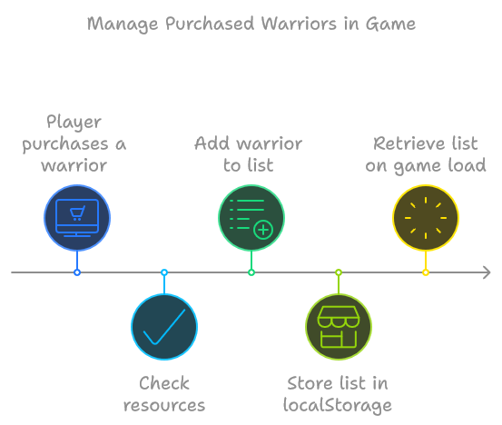

# University Project: Armies of the Burrow

This project was developed as part of a university assignment with a focus on building a browser-based strategy game using modern web development practices. The primary learning objectives were centered around semantic coding, proper CSS organization, and JavaScript techniques to ensure a clean, maintainable, and scalable codebase.

Link to project site: https://armiesoftheburrow.netlify.app/

## Key Task Requirements

1. **Semantic Coding**:

   - Writing meaningful HTML with appropriate use of elements such as `<header>`, `<section>`, `<article>`, and `<footer>` for better readability and accessibility.

2. **BEM Methodology**:

   - Following the Block Element Modifier (BEM) naming convention to organize CSS, ensuring that styles are modular and maintainable.

3. **Diverse CSS Techniques**:

   - Implementing a range of CSS styling techniques, including the use of a CSS3 Grid system for responsive layouts and media queries to handle different screen sizes.
   - Using FontAwesome for icons and ensuring a consistent user interface across various screen resolutions.

4. **JavaScript (ES6+) Techniques**:
   - Utilizing modern JavaScript features such as arrow functions, `forEach()` for efficient iteration and manipulation of arrays.
   - Organizing game data using arrays of objects, allowing for easier management of warrior and resource data.
   - Employing modules to separate game logic into reusable components, maintaining clean and modular JavaScript code.
   - Persisting game data with `localStorage`, ensuring player armies and resources are stored locally in the browser across sessions.

---

## Managing Purchased Warriors in the Game

In _Armies of the Burrow_, players can purchase warriors and manage resources like gold, metal, and wood. The game uses `localStorage` to store the player's progress. Here is a detailed breakdown of the steps involved:

### 1. Player Purchases a Warrior

When a player clicks the **Buy Warrior** button, the event listener attached to the button triggers the purchase process. The `buyWarrior()` function is invoked, which checks if the player has enough resources to make the purchase.

- `ResourceModule.getResources()` is called to retrieve the current available resources.
- `WarriorModule.buyWarrior()` takes the warrior ID and resources to execute the purchase logic.

### 2. Add Warrior to List

In the `buyWarrior()` function within the `WarriorModule`, the system checks if the player has enough gold. If successful, the warrior is added to the list of purchased warriors.

### 3. Store List in localStorage

Once a warrior is purchased, the updated list is stored in the browser’s `localStorage` using `savePurchasedWarriors()`. This ensures that the player’s progress is saved, even if they close the game.

```javascript
const savePurchasedWarriors = (purchasedWarriors) => {
  localStorage.setItem("purchasedWarriors", JSON.stringify(purchasedWarriors));
};
```

### 4. Retrieve List on Game Load

When the player returns to the game, the warriors they previously purchased are retrieved from `localStorage` using the `getPurchasedWarriors()` function. This ensures that the player’s army is displayed as it was in their last session.

```javascript
const getPurchasedWarriors = () => {
  return JSON.parse(localStorage.getItem("purchasedWarriors")) || [];
};
```

### Visual representation:

The following image visually represents the process of managing purchased warriors in Armies of the Burrow:



This flow ensures that the game is persistent and maintains the player's army across sessions, providing a seamless experience.

# Disclaimer

The images used in **Armies of the Burrow** were generated using AI tools and are strictly for educational and non-commercial purposes. All sounds utilized in the game are free resources obtained from **Mixkit**, which provides free sound effects and music for non-commercial use. This project is part of a university assignment and is not intended for commercial distribution. All assets have been used in accordance with their respective licenses.
